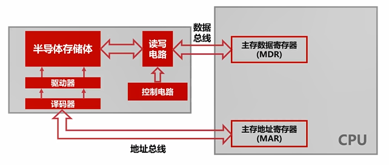
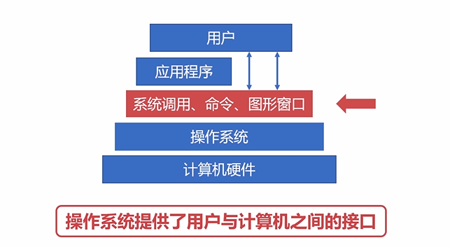
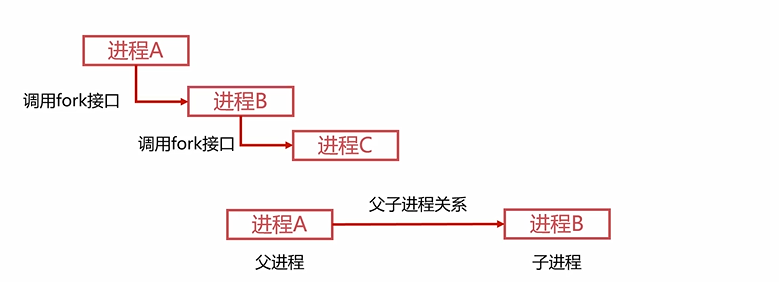
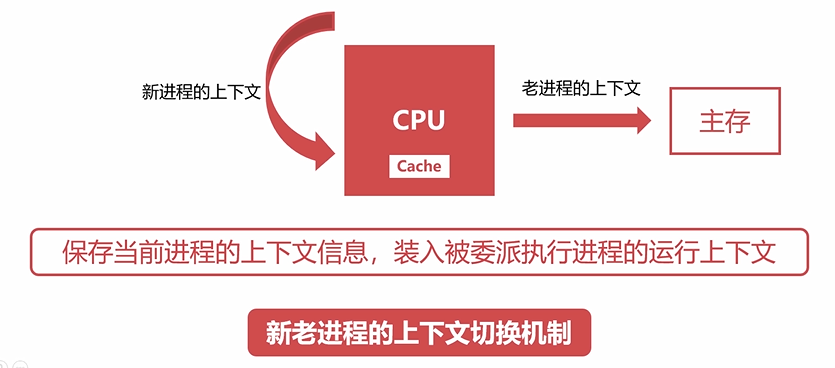

# 编程必备基础

- 计算机组成原理
  - 概述篇
    - 计算机发展史
      - 计算机发展的四个阶段
        - 第一阶段 1946~1957（电子管计算机）：
          - 第二次世界大战是电子管计算机产生的催化剂，为了解密德国海军的密文。
          - 埃尼阿克（ENIAC）
            - 战争使用了飞机和火箭
            - 打得准，则需要计算射击参数
            - 射击参数需要几千次运算才能计算出来
            - 18000 多个电子管
            - 运行耗电量 150千瓦
            - 重量达 30 吨，占地 1500 平方英尺
            - 造价约为 48万美元
          - 集成度小，空间占用大；功耗高，运行速度慢；操作复杂，更换程序需要接线；
        - 第二阶段 1957~1964（晶体管计算机）：
          - 贝尔实验室的三位科学家发明了晶体管
          - 著名的晶体管计算机：TX-0（来自 MIT 林肯实验室）、PDP-1（4k内存，每秒200000指令，配备 512x512的显示器）
          - 集成度相对较高，空间占用相对小；功耗相对较低，运行速度较快；操作相对简单，交互更加方便；
        - 第三阶段 1964~1980（集成电路计算机）：
          - 德州仪器的工程师发明了集成电路（IC），从此以后更多的元件就被集成到了单一的半导体芯片里面使得计算机变得更小、功耗更低、计算速度更快。
          - 当时 IBM 为领头羊，两款计算机卖的很好：7094、1401，主打功能不同，相互也无法兼容，买了的公司不愿意投入两组人力，于是IBM 就推出了兼容的产品 System/360，这就是操作系统的雏形，使得不同的电子元器件，不同电路的计算机都能在同一个操作系统上面运行。
        - 第四阶段 1980~至今（超大规模集成电路计算机）：
          - 一个芯片集成了上百万的晶体管
          - 速度更快体积更小价格更低更能被大众接受
          - 用途丰富：文本处理、表格处理、高交互的游戏与应用
        - 第五阶段：未来的计算机
          - 生物计算机，以蛋白质分子作为主要原材料
          - 量子计算机，遵循量子力学的物理计算机
            - 2013年5月，谷歌和 NASA 发布 D-Wave Two
            - 2017年5月，中国科学院宣布制造出光量子计算机
            - 2019年1月，IBM 展示了世界首款商业化量子计算机
            - 2017年，腾讯组建了量子实验室，阿里巴巴成立了达摩院
      - 微型计算机的发展历史
        - 早期受限于性能，使用的是单核 CPU
          - （1971 ~ 1973）500KHz 频率的微型计算机（字长 8 位）
          - （1973 ~ 1978）高于 1MHz 频率的微型计算机（字长 8 位）
          - （1978 ~ 1985）500MHz 频率的微型计算机（字长 16 位）
          - （1985 ~ 2000）高于 1GHz 频率的微型计算机（字长 32 位）
          - （2000 ~ 至今）高于 2GHz 频率的微型计算机（字长 64 位）
          - 摩尔定律：集成电路的性能，每 18-24 个月就会提升一倍
        - 单核CPU遇到性能瓶颈，多核 CPU
          - （2005）Intel 奔腾系列双核 CPU、AMD 速龙系列
          - （2006）Intel 酷睿四核 CPU
          - Intel 酷睿系列十六核 CPU
          - 服务器领域，Intel 至强系列五十六核 CPU
    - 计算机分类
      - 超级计算机
        - 功能最强、运算速度最快、存储容量最大
        - 多用于国家高科技领域和尖端技术的研究，天气预报、海洋监测、生物制药、科学计算（核聚变核裂变模拟、加密解密算法）
        - 标记他们运算速度的单位是 TFlop/s，1TFlop/s=每秒一万亿次浮点计算，Intel（R）Core（TM）i7-6700k CPU@4.00 GHz：44.87GFlop/s，44.87GFlop/s = 0.01187TFlop/s
        - 截至 2018年11月。世界前三：Summit（美国IBM）、神威太湖之光（中国）、Sierra（美国IBM）。中国前三：神威太湖之光（国家并行计算机工程技术研究中心）、天河二号（国防科大，位于广州大学城-中山大学）、天河一号（国防科大）
      - 大型计算机
        - 又称大型机、大型主机、主机等
        - 具有高性能，可处理大量数据与复杂的运算，银行金融交易的数据、证券交易所的数据处理，人口普查、企业资源规划
        - 在大型计算机市城领域，IBM 占据着很大的份额，COBOL 编程语言
        - IBM Z9，NASA 最后一台大型机，Red Hat Enterprise Linux系统，大型机造价高昂，市场越来越小。
        - 2008年阿里提出去「IOE」行动，I（IBM 服务器提供商），O（Oracle 数据库软件提供商），E（EMC 存储设备提供商），这三者构成了从软件到硬件的企业级数据库系统，当时占领了大部分市城的商业数据库份额。因为「IOE」代表了高维护费用的存储系统，大型机也不够灵活，伸缩性弱，阿里巴巴就开始将海量数据从集中式的 Oracle 切换到了分布式的 MySql 集群，把大型机替换为普通服务器。解决数据库的拓展问题。阿里云 2009 年成立。
      - 迷你计算机（服务器）
        - 也成为小型机，普通服务器
        - 不需要特殊的空调场所
        - 具备不错算力，可以完成较复杂运算
        - 常见制造商：联想、华为、浪潮
        - 普通服务器代替了传统的大型机，成为大规模企业计算的中枢
        - 阿里云腾讯云等等的云厂商都是用这些普通的服务器来构成云服务与数据中心的
      - 工作站
        - 高端的通用微型计算机，提供比个人计算机更强大的性能
        - 类似普通台式电脑，体积较大，性能强劲，主要给图片工作者视频工作者使用。
      - 微型计算机
        - 又称为个人计算机
    - 计算机的体系结构
      - 冯诺伊曼体系：将程序指令和数据一起存储的计算机设计概念结构
        - 早期计算机仅含固定用途程序，改变程序得更改结构重新设计电路，于是就有存储程序指令设计通用电路
        - 必须有一个存储器，存储数据和指令
        - 必须有一个控制器，因为需要存储指令，所以必须知道执行到哪里，下一步该执行什么
        - 必须有一个运算器
        - 必须有输入设备
        - 必须有输出设备
        - 现代计算机都是冯诺依曼机
        - 能够把需要的程序和数据送至计算机中
        - 能够长期记忆程序、数据、中间结果及最终运算结果的能力
        - 能够具备算术、逻辑运算和数据传送等数据加工处理的能力
        - 能够按照要求将处理结果输出给用户
        - 冯诺依曼瓶颈：CPU 和存储器速率之间的问题无法调和，CPU 经常空转等待数据传输
      - 现代计算机结构
        - 现代计算机在冯诺依曼体系结构基础上进行修改
        - 解决 CPU 与存储设备之间的性能差异问题
        - 更高速的存储设备：内存、CPU的寄存器
        - 现代计算机的结构可以理解为以存储器为核心的结构
    - 计算机的层次与编程语言
      - 程序翻译与程序解释
        - 程序翻译是将较为高级的计算机语言通过编译器翻译成较为低级的计算机实际执行的语言。
        - 程序解释是将较为高级的计算机语言通过由较为低级的计算机语言实现的解释器解释成较为低级的计算机实际执行的语言。
        - Java 和 C# 属于翻译+解释型的语言，Java 先编译成 JVM 字节码 然后解释成机器码执行，是在 JVM 虚拟机中编写
      - 计算机的层次与编程语言
        - 实际机器
          - 硬件逻辑层
            - 门、触发器等逻辑电路组成
            - 属于电子工程的领域
          - 微程序机器层
            - 编程语言是**微指令集**
            - **微指令**所组成的**微程序**直接交由硬件执行
          - 传统机器层
            - 编程语言是**CPU 指令集（机器指令）**
            - 编程语言和硬件直接相关
            - 不同架构的 CPU 使用不同的 CPU 指令集
            - 机器指 = 微程序 > 微指令
        - 虚拟机器
          - 系统软件
            - 操作系统层
              - 向上提供了简易的操作界面
              - 向下对接了指令系统，管理硬件资源
              - 操作系统是在软件和硬件之间的适配层
            - 汇编语言层
              - 编程语言是**汇编语言**
              - 汇编语言可以**翻译**成可以直接执行的机器语言，完成翻译过程的程序就是汇编器
            - 高级语言层
              - 编程语言为广大程序员所接受的高级语言
              - 高级语言的类别非常多，有几百种
              - 常见的高级语言有：Python、Java、C/C++、Golang等
          - 应用软件
            - 应用层
              - 满足计算机针对某种用途而专门设计
    - 计算机的计算单位
      - 容量单位
        - 在物理层面，高低电平记录信息
        - 理论上只认识 0/1 两种状态，0/1 称为 bit（比特位）
        - 字节：1Byte = 8 bits，字节和比特位使用的是八进制位，1024=2^10
        - 
        - 硬盘厂商一般用10 进位标记容量
      - 速度单位
        - 网络速度
          - 比如 100M 宽带
          - 为什么电信拉的100M光纤，测试峰值速度只有12M每秒？
          - 网络常用单位为（Mbps）
          - 100M/s = 100Mbps = 100Mbit/s
          - 100Mbit/s = (100/8)MB/s = 12.5MB/s
        - CPU 频率
          - CPU 速度一般体现为 CPU 的时钟频率
          - CPU 时钟频率的单位一般是赫兹（Hz）
          - 主流 CPU 的时钟频率都在 2GHz 以上
          - Hz 其实就是秒分之一，它是每秒钟的周期性变动重复次数的计量
          - Hz 并不是描述计算机领域所专有单位
          - 在 CPU 中使用高低电平表达 0 和 1，所以对于CPU的频率其实表达的就是高低电平在每秒钟变换的次数
          - 2GHz = 2*1000^3Hz = 每秒20亿次
    - 计算机的字符与编码集
      - 字符编码集的历史
        - ASCII 码
          - 使用 7 个 bits 就可以完全表示 ASCII 码
          - 包含 95 个可打印字符
          - 33 个不可打印字符（包括控制字符）
          - 33 + 95 = 128 = 2^7
          - 
          - 很多应用或者国家中的符号都无法表示，比如数学符号÷ ≠≥≈
        - Extended ASCⅡ 码
          - 
          - 常见的数学运算符
          - 带音标的欧洲字符
          - 其他常用符、表格符等
        - 字符编码集的国际化
          - 欧洲、中亚、东亚、拉丁美洲国家的语言多样性
          - 语言体系不一样，不以有限字符组合的语言
          - 中国、韩国、日本等的语言最为复杂
      - 中文编码集
        - GB2312（1980年发明）：《信息交换用汉字编码字符集——基本集》
        - 一共收录了 7445 个字符
        - 包括 6763 个汉字和 682 个其他符号
        - 1995年，第二套完备的编码集，GBK：《汉字内码扩展规范》，向下兼容 GB2312，向上支持国际 ISO 标准
        - 收录了 21003 个汉字，支持全部中日韩汉字
        - Unicode（兼容全球的字符集）：统一码、万国码、单一码
        - Unicode 定义了世界通用的符号集，规定了符号的二进制代码，UTF-* 实现了编码
        - UTF-8 以字节为单位对 Unicode 进行编码
  - 组成篇
    - 计算机总线：连接计算机不同设备的数据线
      - 总线的概述
        - 是什么，有什么用：
          - USB（Universal Serial Bus 通用串行总线）
          - 提供了对外连接的接口
          - 不同设备可以通过USB 接口进行连接
          - 连接的标准，促使外围设备接口的统一
          - USB、PCI总线、ISA总线、Thunderbolt总线（苹果电脑的）
        - 总线的分类
          - 片内总线（高集成度芯片内部的信息传输线）
            - 芯片内部的总线
            - 寄存器与寄存器之间
            - 寄存器与控制器、运算器之间
          - 系统总线（CPU、主内存、IO设备、各组件之间的信息传输线）
            - 数据总线，总线的位数一般与 CPU 位数相同（32位、64位）
              - 双向传输各个部件的数据信息
              - 数据总线的位数（总线宽度）是数据总线的重要参数
            - 地址总线，用于传输数据的地址，用于数据的寻址，地址总线位数=n，寻址范围：0~2^n
              - 指定源数据或目的数据在内存中的地址
              - 地址总线的位数与存储单元的位数有关
            - 控制总线
              - 用来发出各种控制信号的传输线
              - 控制信号经由控制总线从一个组件发给另一个组件  
              - 控制总线可以监视不同组件之间的状态（就绪/未就绪）
      - 总线的仲裁
        - 为什么需要总线仲裁？为了解决总线使用权的冲突问题
        - 总线仲裁的方法
          - 链式查询
            - 好处：电路复杂度低，仲裁方式简单
            - 坏处：优先级低的设备难以获得总线使用权
            - 坏处：对电路故障敏感（串联电路通病）
          - 计时器定时查询
            - 仲裁控制器对设备编号，并使用计数器累计计数
            - 接收到仲裁信号后，往所有设备发出计数值
            - 计数值与设备编号一致则获得总线使用权
          - 独立请求
            - 每个设备均有总线独立连接仲裁器
            - 设备可单独向仲裁器发送请求和接受请求
            - 当同时收到多个请求信号，仲裁器有权按优先级分配使用权
            - 好处：响应速度快，优先顺序可动态改变
            - 坏处：设备连线多，总线控制复杂
    - I/O 设备
      - 常见的输入输出设备
        - 字符输入设备
          - 键盘
            - 薄膜键盘
            - 机械键盘，根据段落感、声音、压力、键程可分为：黑轴、红轴、青轴（敲击带感）、茶轴
        - 图形输入设备：鼠标、数位板（输入板和压感笔）、扫描仪（将图形信息转换为数字信号）
        - 图形输出设备：显示器（CRT显示器、液晶显示器）、打印机、投影仪
      - 输入输出接口的通用设计
        - 数据线
          - 是 I/O 设备与主机之间进行数据交换的传送线
          - 单向传输
          - 双向传输数据线
        - 状态线
          - IO 设备状态向主机报告的信号线
          - 查询设备是否已经正常连接并就绪
          - 查询设备是否已经被占用
        - 命令线
          - CPU 向设备发送命令的信号线
          - 发送读写信号
          - 发送启动停止信号
        - 设备选择线
          - 主机选择 I/O 设备进行操作的信号线
          - 对连在总线上的设备进行选择
      - CPU 与 IO 设备的通信
        - 程序中断：提供低速设备通知 CPU 的一种异步的方式，CPU 可以高速运转的同时兼顾低速设备的响应
          - 当外围 I/O 设备就绪时，向 CPU 发出中断信号
          - CPU 有专门的电路响应中断信号
        - DMA（直接存储器访问），当主存与 IO 设备交换信息时，不需要中断 CPU，可以提高CPU效率
          - DMA 直接连接主存与 IO 设备
          - DMA 工作时不需要 CPU 参与
          - 硬盘、外置显卡里都有 DMA 设备
    - 存储器
      - 存储器的分类
        - 按存储介质分类可分为：
          - 半导体存储器：存储的元器件是由半导体元器件组成的，例如：内存、U 盘、固态硬盘
          - 磁存储器：金属或者塑料表面涂抹一层磁性材料作为存储介质的存储器，例如：磁带、磁盘
        - 按存取方式分类：
          - 随机存储器（RAM），任何单元都能随机读取、与位置无关
          - 串行存储器，存取的时候与位置有关，按顺序查找
          - 只读存储器（ROM），例如 BIOS、手机固件都是存储在 ROM 里面
      - 存储器的层次结构，平时考虑存储器会考虑什么？读写速度（5400转、7200转）、存储容量、价格。容量+价格=>位价：每比特位价格，用于表达存储器的性价比
        - 缓存：指 CPU 里的寄存器或者高速缓存
        - 主存：计算机里的内存
        - 辅存：计算机里的外部存储设备，比如：磁盘、U盘、移动硬盘
        - 
        - 「缓存-主存层级」
          - 原理：局部性原理，指的是 CPU 访问存储器时，无论是**存取指令**还是**存取数据**，所访问的存储单元都**趋于聚集在一个较小的连续区域中**
          - 实现：在 CPU 与主存之间增加一层速度快（容量小）的 Cache
          - 目的：解决主存速度不足的问题
        - 「主存-辅存层次」
          - 原理：局部性原理
          - 实现：主存之外增加辅助存储器（磁盘、SD 卡、U盘等）
          - 目的：解决主存容量不足的问题
    - 计算机的主存储器与辅助存储器，「为什么计算机断电，内存数据会丢失？」、「为什么计算机断电，磁盘数据不会丢失？」
      - 主存储器——内存
        - RAM（随机存取存储器：Random Access Memory）
        - RAM 通过**电容**存储数据，必须隔一段时间刷新一次
        - 如果断电，那么一段时间后将丢失所有数据
        - 
        - 32位系统最多支持 2^32 = 4 * 2^30 = 4GB
        - 32位系统最多支持 2^64 = 2^34 * 2^30 = 2^34GB
      - 辅助存储器——磁盘
        - 
        - 表面是可磁化的硬磁特性材料
        - 移动磁头径向运动读取磁道信息
        - 先来先服务算法：按顺序访问进程的磁道读写需求
        - 最短寻道时间优先：调度的顺序与磁头当前位置有关，优先访问离磁头最近的磁道
        - 扫描算法（电梯算法）：磁头每次只往一个方向移动，到达一个方向需要服务的尽头再反方向移动
        - 循环扫描算法：只往一个方向读取
      - 计算机的高速缓存
        - 高速缓存的工作原理
          - 字：是指存放在一个存储单元中的二进制代码组合
          - 字块：存储在连续的存储单元中而被看作是一个单元的一组字
          - 命中率是衡量缓存的重要性能指标
          - 理论上 CPU 每次都能从高速缓存取数据的时候，命中率为1
        - 高速缓存的替换策略
          - 
          - 随机算法
          - 先进先出算法（FIFO）
          - 最不经常使用算法（LFU），优先淘汰最不经常使用的字块，需要额外的空间记录字块的使用频率
          - 最近最少使用算法（LRU），优先淘汰一段时间内没有使用的字块，一般使用双向链表，把当前访问节点置于链表前面（保证链表头部节点是最近使用的）
    - 指令系统
      - 机器指令的形式
        - 主要由两部分组成：操作码、地址码
        - 操作码指明指令所要完成的操作
        - 操作码的位数反映了机器的操作种类
        - 地址码直接给出操作数或者操作数的地址
        - 分三地址指令、二地址指令和一地址指令
        - 零地址指令：在机器指令中无地址码，空操作、停机操作、中断返回操作等
      - 机器指令的操作类型
        - 数据传输
          - 寄存器之间、寄存器与存储单元、存储单元之间传送
          - 数据读写、交换地址数据、清零置一等操作
        - 算术逻辑操作
          - 操作数之间的加减乘除运算
          - 操作数的与或非等逻辑运算
        - 移位操作
          - 数据左移（乘2）、数据右移（除2）
          - 完成数据在算术逻辑单元的必要操作
        - 控制指令
          - 等待指令、停机指令、空操作指令、中断指令等
      - 机器指令的寻址方式
        - 指令寻址：顺序寻址、跳跃寻址
        - 数据寻址：
          - 立即寻址：指令直接获得操作数，无需访问存储器
          - 直接寻址：直接给出操作数在主存的地址，寻找操作数简单，无需计算数据地址
          - 间接寻址：指令地址码给出的是操作数地址的地址，需要访问一次或多次主存来获取操作数
    - 计算机的控制器：协调和控制计算机运行的
      - 
      - 程序计数器：用来存储吓一跳指令的地址，循环从程序计数器拿出指令，当指令被拿出时，指向下一条指令
      - 时序发生器：电气工程领域，用于发送时序脉冲，CPU 根据不同的时序脉冲有节奏的进行工作
      - 指令译码器：是控制器的主要部件之一，计算机指令由操作码和地址码组成，翻译操作码对应的操作以及控制传输地址码对应的数据
      - 指令寄存器：指令寄存器也是控制器的主要部件之一，从主存或高速缓存存取计算机指令
      - 主存地址寄存器：保存当前 CPU 正要访问的内存单元地址
      - 主存数据寄存器：保存当前 CPU 正要读或写的主存数据
      - 通用寄存器：用于暂时存放或传送数据或指令，可保存 ALU 的运算中间结果，容量比一般专用寄存器要大
    - 计算机的运算器：是用来进行数据运算加工
      - 
      - 数据缓冲器
        - 分为输入缓冲和输出缓冲
        - 输入缓冲暂时存放外设送过来的数据
        - 输出缓冲暂时存放送往外设的数据
      - ALU：算术逻辑单元，是运算器的主要组成
        - 可以完成常见的位运算（左右移、与或非等）
        - 算术运算（加减乘除等）
      - 状态字寄存器
        - 存放运算状态（条件码、进位、溢出、结果正负等）
        - 存放运算控制信息（调试跟踪标记位、允许中断位等）
      - 通用寄存器
        - 用于暂时存放或传送数据或指令
        - 可保存 ALU 的运算中间结果
        - 容量比一般专用寄存器要大
    - 计算机指令的执行过程
      - 指令执行过程（取指令→分析指令→执行指令）
      - CPU 的流水线设计
        - 类似工厂的装配线
        - 工厂的装配线使得多个产品可以同时被加工
        - 在同一时刻，不同产品均位于不同的加工阶段
  - 计算篇
    - 进制运算的基本知识
      - 进制运算的基础
        - 进制的概述
          - 进位制是一种记数方式，亦称进位计数法或位值计数法
          - 有限种数字符号来表示无限的数值
          - 使用的数字符号的数目称为这种进位制的基数或底数
          - 八进制
          - 十六进制：[0-9]和A、B、C、D、E、F
          - 二十进制：玛雅文明的玛雅数字，因努伊特的因努伊特数字
          - 六十进制：时间、坐标、角度等量化数据
          - 二进制
        - 二进制运算的基础
    - 二进制数据的表示方法
      - 有符号数与无符号数
        - 使用 0 表示正数，1 表示负数
        - 规定符号位位于数值第一位
        - 原码表示法的缺点：
          - 有两种表示方法：00、01
          - 原码进行运算非常复杂，特别是两个操作数符号不同的时候
          - 判断两个操作数绝对值大小
          - 使用绝对值大的数减去绝对值小的数
          - 对于符号值，以绝对值大的为准
          - 希望找到不同符号操作数更加简单的运算方法
          - 希望找到使用正数代替负数的方法
          - 使用加法操作代替减法操作，从而消除减法
      - 二进制的补码表示法
        - 
      - 二进制的反码表示法
        - 
        - 负数的反码等于原码除符号位外按位取反
        - 负数的补码等于反码+1
        - 
      - 小数的二进制补码表示法
        - 
    - 二进制数据的运算
      - 定点数与浮点数
        - 定点数的表示方法
          - 小数点固定在某个位置的数
        - 浮点数的表示方法
          - 计算机处理的很大程度上不是纯小数或纯整数
          - 数据范围很大，定点数难以表达
          - 浮点数的表示格式
            - 
          - 浮点数的表示范围
            - 
            - 
            - 单精度浮点数：使用 4 字节、32位来表达浮点数（float）
            - 双精度浮点数：使用 8 字节、64位来表达浮点数（double）
          - 浮点数的规格化
        - 定点数与浮点数的对比
          - 当定点数与浮点数位数相同时，浮点数表示的范围更大
          - 当浮点数尾数为规格化数时，浮点数的精度更高
          - 浮点数运算包含阶码和尾数，浮点数的运算更为复杂
          - 浮点数在数的表示范围、精度、溢出处理、编程等方面均优于定点数
          - 浮点数在数的运算规则、运算速度、硬件成本方面不如定点数
      - 定点数的加减法运算
        - 整数加法：`A[补]+B[补]=[A+B][补](mod2^n+1)`
        - 小数加法：`A[补]+B[补]=[A+B][补](mod2)`
        - 数值位与符号位一同运算，并将符号位产生的进位自然丢掉
        - 判断溢出
          - 双符号位判断法
            - 单符号位表示变成双符号位：0=>00,1=>11
            - 双符号位产生的进位丢弃
            - 结果的双符号位不同则表示溢出
        - 整数减法：`A[补]-B[补]=[A+(-B)][补](mod2^n+1)`
        - 小数减法：`A[补]-B[补]=[A+(-B)][补](mod2)`
        - `-B[补]`等于`B[补]`连同符号位按位取反，末位加一
      - 浮点数的加减法运算
        - 
        - 
        - 对阶的目的是使得两个浮点数阶码一致，使得尾数可以进行运算
        - 浮点数尾数运算简单，浮点数位数实际小数位与阶码有关，阶码按小阶看齐大阶的原则
        - 尾数求和：使用补码进行运算，减法运算转化为加法运算：`A-B=A+(-B)`
        - 
        - 
        - 舍入
        - 溢出判断
          - 定点运算双符号位不一致为溢出
          - 浮点运算尾数双符号位不一致不算溢出
          - 因为尾数双符号位可以进行右规
          - 浮点运算主要通过阶码的双符号位判断是否溢出
          - 如果尾数的规格化后，阶码双符号位不一致，则认为是浮点数的溢出
      - 浮点数的乘除法运算
        - 
        - 
  - 综合实践
    - 单向链表：每一个节点都有下一个节点的地址或引用
    - 双向链表：每一个节点都有上一个节点和下一个节点的地址或引用
      - 可以快速找到一个节点的上一个节点
      - 可以快速去掉链表中的某一个节点
      - 
      - 实现参照<./gaia/computer_principle/DoubleLinkedList.py>
    - FIFO: 缓存置换算法，先进先出，淘汰缓存时，把最先进入链表的节点淘汰
    - LFU：最不经常使用算法，淘汰缓存时，把使用频率最小的淘汰，同频率节点按FIFO算法淘汰
      -   
    - LRU：缓存置换算法，最近最少使用算法,淘汰缓存时，表链表尾部的节点淘汰
- 操作系统
  - 操作系统的演进
    - 无操作系统：人工操作、用户独占、CPU等待人工操作，资源利用率很低
    - 批处理系统：无需等待人工操作，批量输入任务、资源利用率提升、多道程序设计
    - 分时系统：人-机交互、多用户共享、及时调试程序
  - 多道程序设计：早期批处理系统只能一次处理一个任务，多道程序设计使得批处理系统可以一次处理多个任务，多道程序设计是指在计算机内存中同时存放多个程序，多道程序在计算机的管理程序之下相互穿插运行，对多道程序的管理是操作系统的重要功能。
  - What&Why
    - 操作系统是管理计算机硬件和软件资源的**计算机程序**，管理硬件、提供用户交互的软件系统
    - 管理配置内存、决定资源供需顺序、控制输入输出设备等
    - 操作系统提供让用户和系统交互的操作界面
    - 操作系统的种类是多种多样的，不局限于计算机
    - 从手机到超级计算机，操作系统可简单也可复杂
    - 在不同的设备上，操作系统可向用户呈现多种操作手段
    - 我们不可能直接操作计算机硬件
    - 设备种类繁多复杂，需要统一界面
    - 操作系统的简易性使得更多人能够使用计算机
  - 操作系统的基本功能
    - 一、操作系统统一管理着计算机资源，如处理器资源、存储器资源、IO设备资源、文件资源
    - 二、操作系统实现了对计算机资源的抽象，用户无需面向硬件接口编程；IO设备管理软件，提供读写接口；文件管理软件，提供操作文件接口；
    - 三、操作系统提供了用户与计算机之间的接口，图像窗口形式、命令形式、系统调用形式
    - 
  - 操作系统相关概念
    - **并发性**（后面三种特性的前提）
      - 并行 vs 并发
      - 并行是指两个或多个事件可以在**同一个时刻**发生
      - 并发是指两个或多个事件可以在**同一个时间间隔**发生
      - 
      - 多道程序设计是并行并发的基础，对于单处理器来说程序是并发执行的
      - 
    - 共享性
      - 共享性表现为操作系统中的资源可供多个并发的程序共同使用
      - 这种共同使用的模式称之为资源共享
      - 
      - 互斥共享：当资源被程序A占用时，其他想使用的话只能等待，只有进程A使用完以后，其他进程才可以使用该资源，如打印机。
      - 同时访问形式：某种资源的在一段时间内**并发地**被多个程序访问，这种同时是宏观的，从宏观去看，该资源可以被同时访问。
    - 虚拟性
      - 表现为把一个物理实体转变为若干个逻辑实体，物理实体是真实存在的，逻辑实体是虚拟的
      - 虚拟技术主要有**时分复用技术**和**空分复用技术**
      - 时分复用技术：资源在时间上进行复用，不同程序并发使用；多道程序分时的使用计算机的硬件资源；
        - 虚拟处理器技术：借助多道程序设计技术，为每个程序建立进程，多个程序分时复用处理器来执行相关逻辑
        - 虚拟设备技术：物理设备虚拟为多个逻辑设备，每个程序占用一个逻辑设备，多个程序通过逻辑设备并发访问
      - 空分复用技术：用来实现虚拟磁盘、虚拟内存等，提高资源的利用率，提升编程效率
        - 虚拟磁盘技术：物理磁盘虚拟为逻辑磁盘，C、D、E等逻辑盘，使用起来更加安全方便
        - 虚拟内存技术：在逻辑上扩大程序的存储容量，使用比实际内存更大的容量，大大提升编程效率
    - 异步性
      - 在多道程序环境下，允许多个进程并发执行
      - 进程在使用资源时可能需要等待或放弃
      - 进程的执行并不是一气呵成的，而是走走停停的形式推进的
      - 
  - 基础篇：环境为 Vmware WorkStation + Ubuntu
    - 进程管理
      - 进程管理之进程实体
        - 为什么需要进程：没有配置OS之前，资源属于当前运行的程序，只能一个程序接着一个程序的运行，配置OS之后，引入多道程序设计的概念，合理的隔离来资源、运行环境，提升资源利用率
          - 进程是系统进行资源分配和调度的基本单位
          - 进程作为程序独立运行的载体保障程序正常执行
          - 进程的存在使得操作系统资源的利用率大幅提升
        - 进程的实体
          - 主存中的进程形态
          - 
          - 标识符：标识符唯一标记一个进程，用于区别其他进程
          - 状态：标记进程的进程状态，如：运行态 or 阻塞状态
          - 程序计数器：进程即将被执行的下一条指令的地址
          - 内存指针：程序代码、进程数据相关指针
          - 上下文数据：进程执行时处理器存储的数据
          - IO状态信息：被进程IO操作所占用的文件列表
          - 记账信息：使用处理器时间、时钟数总和等，这些数据在调试或者在获取状态时都是很有用的
          - 
          - 进程控制块（PCB）：用于描述和控制进程运行的通用数据结构，记录进程的当前状态和控制进程运行的全部信息，PCB使得进程是能够独立运行的基本单位，PCB是操作系统进程调度经常会被读取的信息，PCB是常驻内存的，存放在系统专门开辟的PCB区域内
        - 进程（Process）与线程（Thread）
          - 线程是操作系统进行运行调度的最小单位，进程是系统进行资源分配和调度的基本单位
          - 线程是包含在进程当中，是进程中实际运行工作的单位
          - 一个进程可以并发多个线程，每个线程执行不同的任务
          - 进程的线程共享进程资源
          - 
      - 进程管理之五状态模型
        - 就绪：
          - 当进程被分配到除CPU以外所有必要的资源后
          - 只要在获得CPU的使用权，就可以立即运行
          - 其他资源都准备好、只差CPU资源的状态为就绪状态
          - 在一个系统中多个处于就绪状态的进程通常排成一个队列，就绪队列
        - 执行：
          - 进程获得CPU，其程序正在执行称为执行状态
          - 在单处理机中，在某个时刻只能有一个进程是处于执行状态
          - 阻塞队列
        - 阻塞：
          - 进程因某种原因如：其他设备未就绪而无法继续执行
          - 从而放弃CPU的状态称为阻塞状态，如打印机
        - 创建
          - 分配PCB => 插入就绪队列
          - 创建进程时拥有PCB但其他资源尚未就绪的状态称为创建状态，操作系统提供fork函数接口创建进程。
        - 终止
          - 系统清理 => PCB归还
          - 进程结束由系统清理或这归还PCB的状态称为终止状态
        - 
      - 进程管理之进程同步
        - 为什么需要进程间同步
          - 生产者-消费者问题：有一群生产者进程在生产产品，并将这些产品提供给消费者进程进行消费，生产者进程和消费者进程可以并发执行，在两者之间设置了一个具有n个可缓冲区的缓冲池，生产者进程需要将所生产的产品放到缓冲区中，消费者进程可以从缓冲区中取走产品消费。
          - 
          - 在计算机里面缓冲区是位于Cache（高速缓存或者主存）上面
          - 如果生产者或者消费者需要操作缓冲区需要三个步骤
            - 先把缓冲区里的数据取出来，放到计算机的寄存器里面 register=count
            - 在CPU的寄存器里面把register加1，register=register+1，表示生产完成了一个产品
            - 把register 放回到缓冲区里面，count=register
          - 单从生产者程序或者消费者程序看是没有问题的
          - 但两者并发执行时就可能出差错，轮流操作缓冲区导致数据不一致
          - 
          - 哲学家进餐问题：有五个哲学家，他们的生活方式是交替地进行思考和进餐，哲学家们共同的使用一张圆桌，分别坐在周五的五张椅子山，在圆桌上有五个碗和五只筷子。平时哲学家只进行思考，饥饿时则试图取靠近他们的左右两边的筷子，只有两支筷子都被他们拿到的时候就能进餐，进餐完毕之后放下筷子继续思考。如果五个哲学家都拿一支筷子等待其他人释放另一只筷子的资源那么哲学家将饿死。
          - 根源问题是：彼此相互之间没有通信
          - “如果生产者通知消费者我已经完成一件生产”
          - “哲学家向旁边哲学家说我要进餐了”
          - 进程间同步解决了：对竞争资源在多进程间进行使用次序的协调
        - 进程间同步原则
          - 临界资源：指的是一些虽作为共享资源却又无法同时被多个线程共同访问的共享资源。当有进程在使用临界资源时，其他进程必须依据操作系统的同步机制等待占用进程释放该共享资源才可以重新竞争使用共享资源。
          - 原则一、空闲让进：资源无占用，允许使用
          - 原则二、忙则等待：资源有占用，请求进程等待
          - 原则三、有限等待：保证有限等待时间能够使用资源
          - 原则四、让权等待：等待时，进程需要让出CPU
        - 进程同步的方法：
          - 消息队列
          - 共享存储
          - 信号量
        - 线程同步
          - 进程的线程共享进程资源
          - 当多个线程并发的使用进程资源时，会发生什么？——进程内多线程也需要同步
          - 线程同步的方法：
            - 互斥量：保证多线程可以互斥的使用临界资源的一个锁
            - 读写锁：是应对多读少写或者少读多写的情况发明的锁
            - 自旋锁：
            - 条件变量：
      - Linux的进程管理
        - Linux进程相关概念
          - 进程的类型
            - 前台进程：通过命令行使用Linux的时候就是使用终端Shell，前台进程就是具有终端，可以和用户交互的进程。
            - 后台进程：与前台进程相对，没有占用终端的就是后台进程，后台程序基本上不和用户交互，优先级比前台进程低。**将需要执行的命令以“&”符号结束**。比如：`python3 running_process.py &`。
            - 守护（daemon）进程（特殊的后台进程）
              - 很多守护进程在系统引导的时候启动，一直运行到系统关闭
              - Linux有很多典型的守护进程，**进程名字以“d”结尾的一般都是守护进程**，例如：crond（定时任务守护进程）、httpd（http服务的）、sshd、mysqld。
          - 进程的标记
            - 进程ID：是进程的唯一标记，每个进程拥有不同的ID，表现为一个非负整数，最大值由操作系统限定
              - 操作系统提供fork函数接口创建进程，进程的层级关系：
              - 
              - 父子进程关系可以通过pstree命令查看
              - ID为0的进程为idle进程，是系统创建的第一个进程
              - ID为1 的进程为init进程，是0号进程的子进程，完成系统的初始化
              - init进程是所有用户进程的祖先进程
            - 进程的状态标记
              - 通过 `man ps` 来了解linux 各种进程状态的标记
              - 
              - 
        - 操作Linux进程的相关命令
          - ps：常用于显示当前进程的状态，常配合aux参数或者ef参数和grep命令检索特点进程
            - `ps -aux` 打印进程详细信息
            - `ps -u root` 查看root 用户的进程
            - `ps -aux | grep 'python3'` 查看特定进程
            - `ps -ef --forest` 查看进程树
            - `ps -aux --sort=-pcpu` 按照cpu的使用频率进行排序
            - `ps -aux --sort=-pmem` 按照内存进行排序
          - top：看linux进程内存或其他状态，PR 代表优先级，VIRT 是进程的虚拟内存
          - kill：给进程发送指定信号，**只有（SIGKIll 9）信号可以无条件终止进程，其他信号进程有权忽略**
            - `kill -l` 查看操作系统支持的信号
            - `kill -9 <进程ID>` 代表进程需要无条件的停止下来
    - 作业管理
      - 作业管理之进程调度：是指计算机通过决策决定哪个就绪的进程可以获得CPU的使用权，跟多道程序设计密切相关
        - 第一个步骤：保留旧进程的运行信息，请出旧进程（收拾包袱）
        - 第二个步骤：选择新进程，准备运行环境并分配CPU（新进驻）
        - 进程调度的三种基本机制：
          - 就绪队列的排队机制：将就绪进程按照一定的方式排列成队列，一边调度的程序可以最快的找到就绪进程
          - 选择运行进程的委派机制：调度程序以一定的策略选择就绪进程，将CPU分配给它
          - 新老进程的上下文切换机制：保存当前进程的上下文信息，装入被委派执行进程的运行上下文
          - 
        - 如果进行进程调度的时候老进程还没执行完呢？按照老进程有没有执行完，可以把进程调度方法分为两大类：
          - 非抢占式调度：
            - 处理器一旦分配给某个进程，就让该进程一直使用下去
            - 调度程序不以任何原因抢占正在被使用的处理器
            - 直到进程完成工作或因为IO阻塞才会让出处理器
          - 抢占式调度
            - 允许调度程序以一定的策略暂停当前运行的进程
            - 保留好旧进程的上下文信息，分配处理器给新进程
          - 
        - 进程调度算法：
          - 先来先服务调度算法
          - 短进程优先调度算法：调度程序优先选择就绪队列中估计运行时间最短的进程，不利于长作业进程的执行
          - 高优先权优先调度算法：进程附带优先权，调度程序优先选择权重高的进程，使得紧迫的任务可以优先处理
          - 时间片轮转调度算法：按照先来先服务的原则排列就绪进程，每次从队列头部取出待执行进程，分配一个时间片执行，每个时间片时间相同，是相对公平的调度算法，但不能保证及时响应用户
      - 作业管理之死锁：死锁是指两个或两个以上的进程在执行过程中，由于竞争资源或者由于彼此的通信而造成的一种阻塞的现象，若无外力作用，它们都将无法推进下去。此时称系统处于死锁状态或系统产生了死锁，这些永远在互相等待的进程称为死锁进程。
        - 死锁的产生
          - 竞争资源
            - 共享资源数量不满足各个进程需求
            - 各个进程之间发生资源竞争导致死锁
            - 
          - 进程调度顺序不当
            - 
          - 死锁的四个必要条件
            - 互斥条件：进程对资源的使用是**排他性使用**，某资源只能由一个进程使用，其他进程需要使用只能等待
            - 请求保持条件：进程至少保持一个资源，又提出新的资源请求，新资源被占用，请求被阻塞，被阻塞的进程不释放自己保持的资源。
            - 不可剥夺条件：进程获得的资源在未完成使用前不能被剥夺，获得的资源只能由进程自身释放
            - 环路等待条件：发生死锁时，必然存在进程-资源环形链
        - 死锁的处理
          - 预防死锁的方法：破坏死锁必要条件中的一个或多个
            - 摒弃请求保持条件：
              - 系统规定进程运行之前，一次性申请所有需要的资源
              - 进程在运行期间不会提出资源请求，从而摒弃请求保持条件
            - 摒弃不可剥夺条件
              - 当一个进程请求新的资源得不到满足时，必须释放占有的资源
              - 进程运行时占有的资源可以被释放，意味着可以被剥夺
            - 摒弃环路等待条件
              - 可用资源线性排序，申请必须按照需要递增申请
              - 线性申请不再形成环路，从而摒弃了环路等待条件
          - 银行家算法
            - 是一个可操作的著名的避免死锁的算法
            - 以银行借贷系统分配策略为基础的算法
            - 客户申请的贷款是有限的，每次申请需要申明最大资金量，银行家在能够满足贷款时，都应该给用户贷款，客户在使用贷款后，能够及时归还贷款。
            - 要求三个数据结构
            - 
    - 存储管理
      - 内存分配与回收：早期计算机编程并不需要过多的存储管理，随着计算机和程序越来越复杂，存储管理成为必要，主要解决三个问题：确保计算机有足够的内存处理数据、确保程序可以从可用内存中获取一部分内存使用、确保程序可以归还使用后的内存以供其他程序使用
        - 内存分配的过程
          - 单一连续分配：单一连续分配是最简单的内存分配方式，只能在单用户、单进程的操作系统中使用
          - 固定分区分配：固定分区分配是支持多道程序的最简单存储配方式，内存空间被划分为若干个固定大小的区域，每个分区只提供给一个程序使用，互不干扰
          - 动态分区分配：根据进程实际需要，动态分配内存空间，涉及到相关数据结构、分配算法
            - 动态分区空闲表数据结构  
            - 动态分区空闲链数据结构  
            - 动态分区分配算法：
              - 首次适应算法（FF算法）
                - 分配内存时从开始顺序查找适合内存区
                - 若没有合适的空闲区，则该次分配失败
                - 每次从头开始，使得头部地址空间不断被划分
                - 循环适应算法从上次检索出开始，对首次适应算法进行了改进
              - 最佳适应算法（BF算法）
                - 最佳适应算法要求空闲区链表按照容量大小排序
                - 遍历空闲区链表找到最佳合适空闲区
                - 可避免大材小用的情况
              - 快速适应算法（QF算法）
                - 快速适应算法要求有多个空闲区链表
                - 每个空闲区链表存储一种容量的空闲区
        - 内存回收的过程
          - 可能会出现四种情况：
            - 
            - 对于第一种情况，不需要新建空闲区链表节点，只需要把空闲区1的容量增大为空闲区即可
            - 对于第二种情况，将回收去与空闲区合并，新的空闲区使用回收区的地址
            - 对于第三种情况，将空闲区1、空闲区2和回收区合并，新的空闲区使用空闲区1的地址
            - 对于第四种情况，为回收区创建新的空闲节点，插入到相应的空闲区链表中去
      - 段页式存储管理：从进程的角度理解进程的存储管理，操作系统如何管理进程的空间？
        - 页式存储管理
        - 段式存储管理
        - 段页式存储管理
      - 虚拟内存
      - Linux的存储管理
    - 文件管理
      - 操作系统的文件管理
      - Linux的文件系统
      - Linux文件的基本操作
    - 设备管理
    - Linux 系统
  - 提升篇
    - 线程同步
    - 进程同步
    - 线程、协程
    - 用户态与内核态
    - 上下文切换
  - 综合实践
    - 线程安全
    - 线程池
    - 同步任务
    - 异步任务
- 计算机网络
  - 概述篇
    - 七层模型
    - 四层协议
    - 物理层
    - 数据链路层
    - 底层协议
  - 网络层篇
    - IP 协议
    - ICMP 协议
    - 子网划分
    - 路由算法
    - IPv6
  - 传输层篇
    - TCP 协议
    - UDP 协议
    - 超时重传机制
    - 拥塞避免算法
    - 心跳保活机制
  - 应用层篇
    - HTTP 协议
    - URL 资源
    - HTTP 结构
    - HTTPS 安全
    - HTTP 服务
  - 综合实践
    - 使用线程池
    - IP 报文
    - ICMP 报文
    - TCP 报文
    - UDP 报文

## 环境说明

- Linux 环境：VMWare WorkStation + Linux 虚拟机
- 编程语言：C++、Python

6-10
